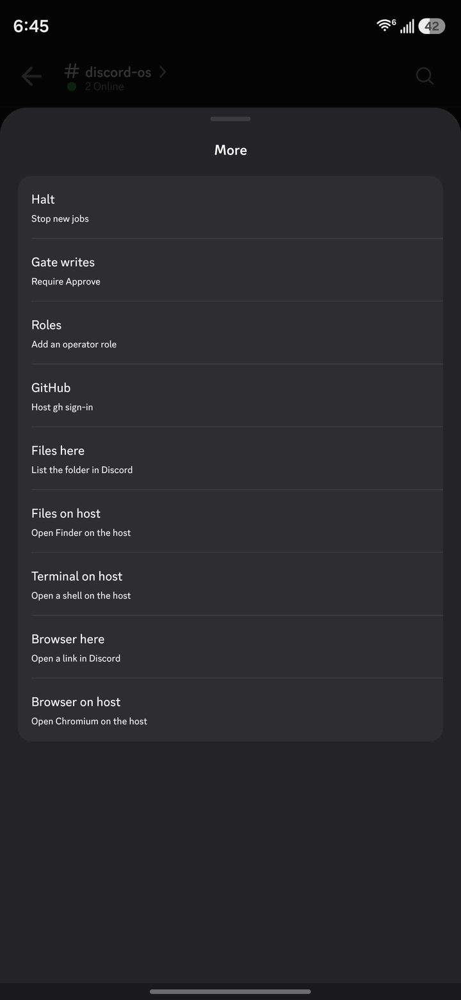
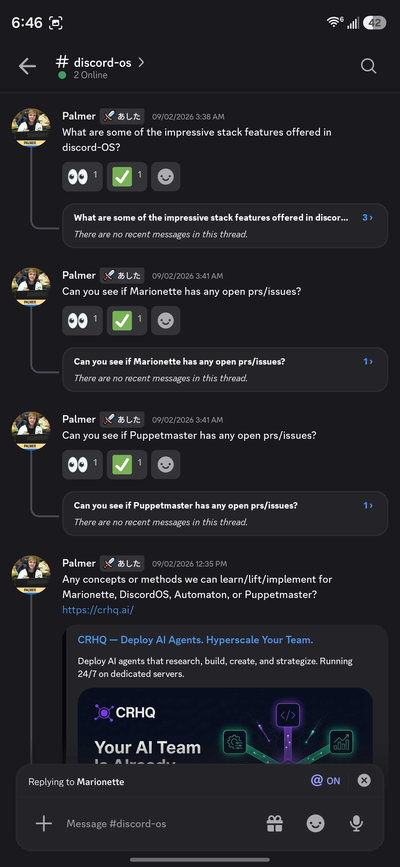

# Discord OS

Discord is the screen. This process is the computer. Your phone is the remote.

SQLite is the database (tasks, runs, events, artifacts, execution DAG). Two Discord threads cook at once. Implement writes serialize per checkout. Puppetmaster runs the workers on this Mac. Artifacts are channel / message / attachment plus sha256, never a CDN URL. Intake is REST. Gateway exists so On/Off buttons work. No hosted fleet.

Query the analog map with `discord-os map`. Dump a run with `discord-os lineage`.

Public package is [`discord-os`](https://pypi.org/project/discord-os/). Repo: [`professorpalmer/discord-os`](https://github.com/professorpalmer/discord-os). The `agent-discord` command still works.

```bash
pip install discord-os
```

## Setup

Once, in a browser: [Discord Developer Portal](https://discord.com/developers/applications) → New Application → **Bot** → Reset Token (`DISCORD_BOT_TOKEN`) → enable **Message Content Intent** → General Information → Application ID (`DISCORD_APPLICATION_ID`). Copy a private channel ID.

Then on the machine that will do the work (Python 3.11+):

```bash
python3 -m venv .venv
source .venv/bin/activate          # Windows: .venv\Scripts\activate
pip install discord-os puppetmaster-ai
export OPENROUTER_API_KEY=...      # never commit
discord-os bootstrap
# put DISCORD_BOT_TOKEN and DISCORD_APPLICATION_ID in .env
discord-os setup --channel-id YOUR_CHANNEL_ID
```

Open the invite URL, press **On**. That is the whole first run.

Workflow seams after that — not a wizard:

```bash
discord-os add realm puppetmaster --channel-id ID
discord-os add memory --channel-id ID
discord-os add wiki --url https://portablellm.wiki/you --token …
discord-os add github --token ghp_...
discord-os add tool aws --bin aws
discord-os add list
```

From Discord you can also type `bind puppetmaster` or `bind memory` in that channel. See [docs/setup](docs/setup/README.md).

## From Discord

| You | Host |
|---|---|
| **On** / **Off** / **Ask** | Power and prompt |
| **More** | Pair, Halt, Gate, Roles, GitHub, Files/Browser here or on host, Terminal on host |
| `bind puppetmaster` | This channel is that checkout |
| `bind memory` | This channel is think-tank |
| a sentence | A task. Two channels cook at once. |





## Docs

Read these if you are an agent in this repo. Start at [docs/](docs/README.md).

| Topic | Path |
|---|---|
| How to read this repo | [AGENTS.md](AGENTS.md) |
| Setup and `add` | [docs/setup](docs/setup/README.md) |
| Host / On / Off / LaunchAgent | [docs/host](docs/host/README.md) |
| Channel realms | [docs/realms](docs/realms/README.md) |
| Parallel jobs | [docs/jobs](docs/jobs/README.md) |
| Host tools (CLI/HTTP, not MCP) | [docs/tools](docs/tools/README.md) |
| Wiki HTTP | [docs/wiki](docs/wiki/README.md) |
| Think-tank memory | [docs/memory](docs/memory/README.md) |
| Live cards | [docs/cards](docs/cards/README.md) |
| Compute and keys | [docs/compute](docs/compute/README.md) |
| Snowflake objects | [docs/objects](docs/objects/README.md) |
| Architecture | [docs/architecture](docs/architecture/README.md) |
| AWS = Discord | [docs/aws](docs/aws/README.md) |
| CLI map | [docs/cli](docs/cli/README.md) |

```bash
pip install -e ".[dev]"
pytest
```

MIT — [`LICENSE`](LICENSE). Third-party Discord adapters: [`THIRD_PARTY_NOTICES.md`](THIRD_PARTY_NOTICES.md).
