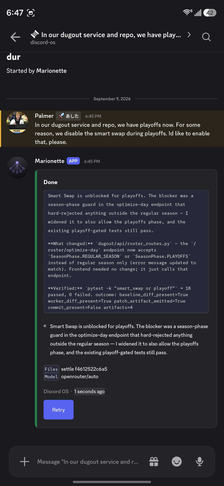

# Cards

One live card per job. That card lives in the **job thread**, not the channel. Components v2 is the console. Discord Activities stay never. Done is a deliverable or a named failure, not a green card with no answer.

The moment an ask lands, Discord OS opens a thread on the user message and posts "On it." Then the worker starts. A Discord 503 on that first card is retried and does not kill the job. The channel stays free. Write-gate **Approve write** edits that same thread card. Approve resumes the same thread. HOST stays in the channel.

Token flushes edit that same card. Reasoning stays in a fenced thinking zone on the card (Discord's native code-block scroll; there is no inner-scroll API). Combined V2 text stays under 4000 characters, so the fence is clipped so the spoken summary always fits. The card body is the spoken summary, not the diary. When a user-facing summary beat changes (or the job hits Done / Failed), the previous spoken beat is persisted as a normal thread message first (Hermes persist-then-settle). Thinking is not reprinted as thread prose. A long public Done answer splits into 2–3 thread messages at sentence boundaries; the Done card can keep the first bubble and extras follow. Short answers stay one message. Do not post a parent-channel excerpt. Do not settle "On it." / "Starting." / empty / percent-only / prompt-echo / host-reach dumps. Do not spam a new message per token.

Done is the spoken summary after process diary is dropped from the body. The diary can remain inside the thinking fence. Worker monologue (`report:`, host-reach dumps) never reaches Discord as the answer.

Harness cards (`**Card**`, `**Receipt**`, HOST, NOTE) are skipped on intake so the bot does not dispatch itself. HOST stays the settings analog — do not dump metrics into job cards.

A follow-up in the job thread stays there (steer). Do not start a nested thread.

## Code

- `src/agent_discord/orchestration/cards.py` — builders, skip rules
- `src/agent_discord/orchestration/orchestrator.py` — reply-first thread, one live card, persist-then-settle
- Tests: `tests/test_cards.py`, `tests/test_orchestration.py`
